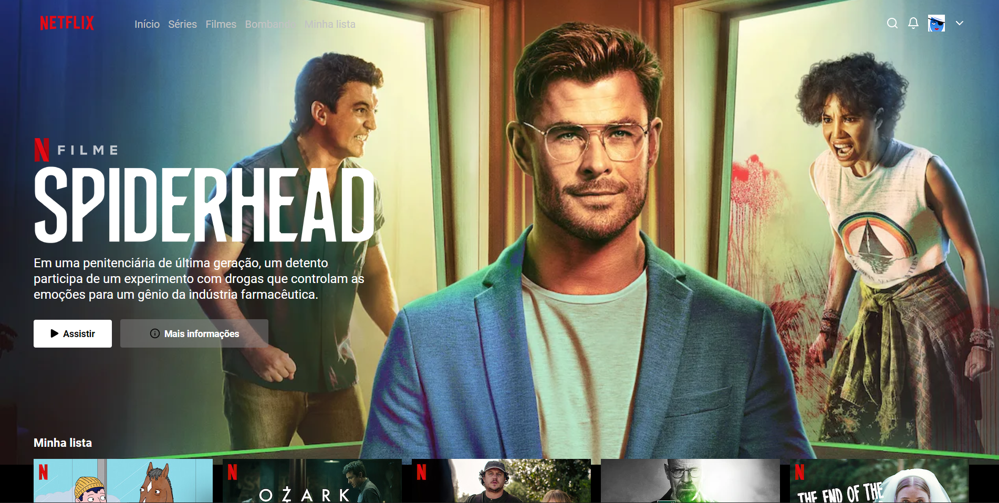

## Visão Geral

### O projeto

- Criar um clone da página principal da Netflix

### Screenshot

### Links

- Live Site URL: [Clone Netflix](https://clone-netflix-kohl-sigma.vercel.app/)

## Meu processo

### Criado com

- HTML
- CSS

### O que eu aprendi

- Aprendi mais sobre estilização com CSS

## Autor

- GitHub - [João Metzdorf](https://github.com/joaometzdorf)
